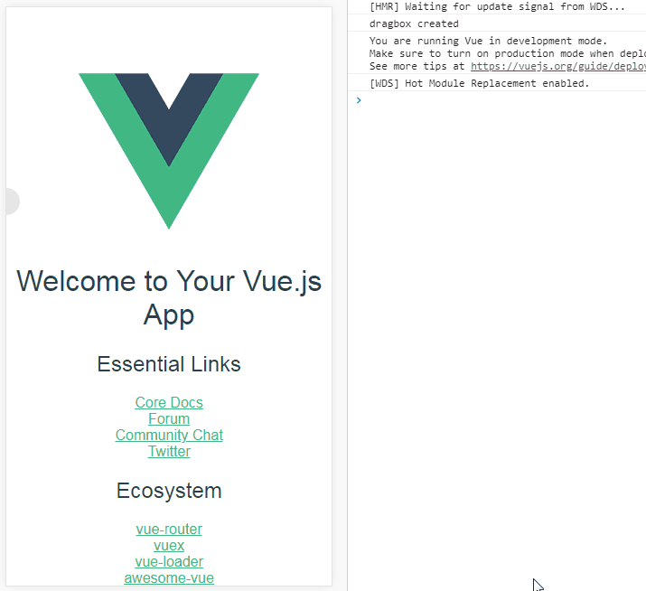

# float-ball
> dragable
> emmm...boring...



## Build Setup

```bash
npm i gsap --save
```

```javascript
import FloatBall from './floatball'
const lalala = new FloatBall()
lalala.onDrag = function (coordinate) {} // 拖动时触发
lalala.onClick = function (coordinate) {} // 活动状态下, 点击时触发
lalala.active() // 使悬浮球处于活动状态
lalala.inactive() // 使悬浮球处于不活动状态
```
